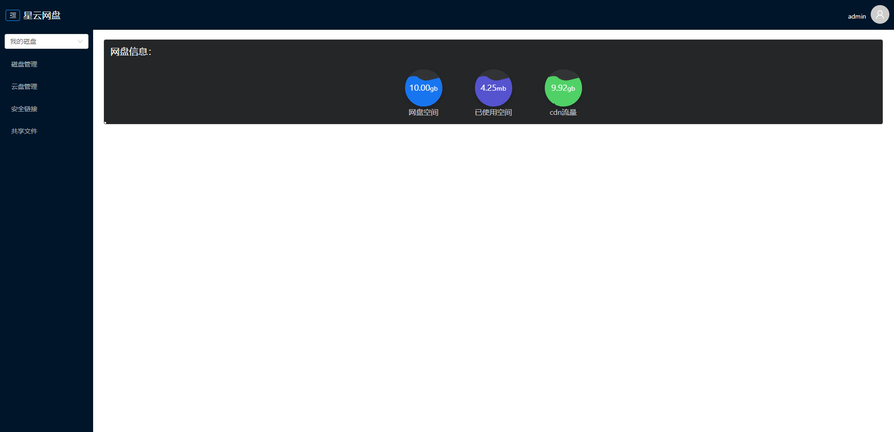
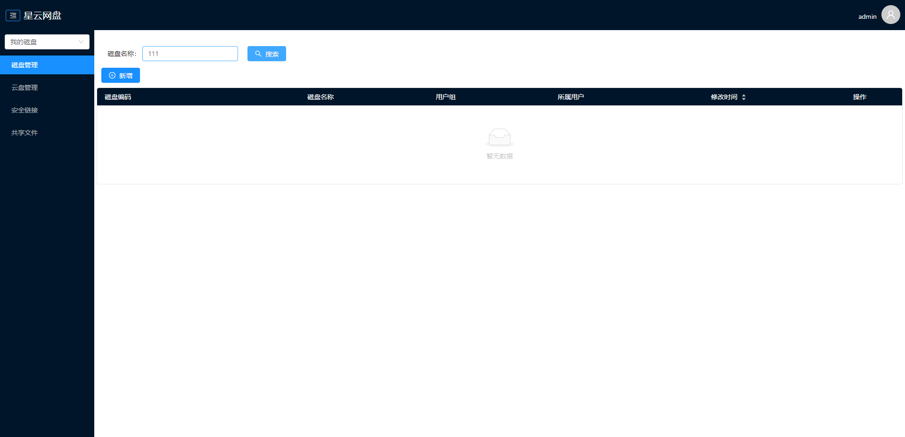
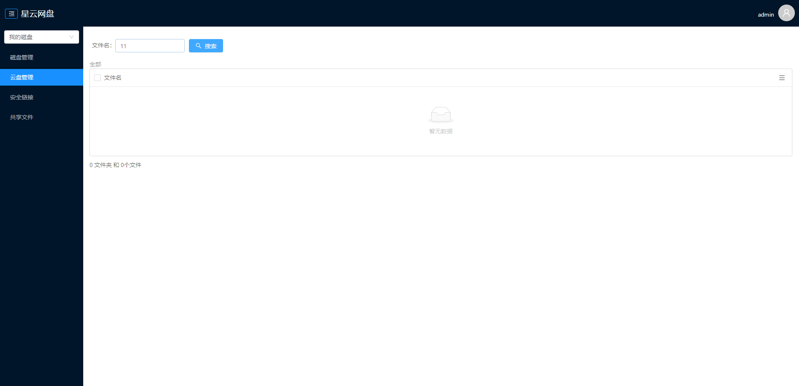
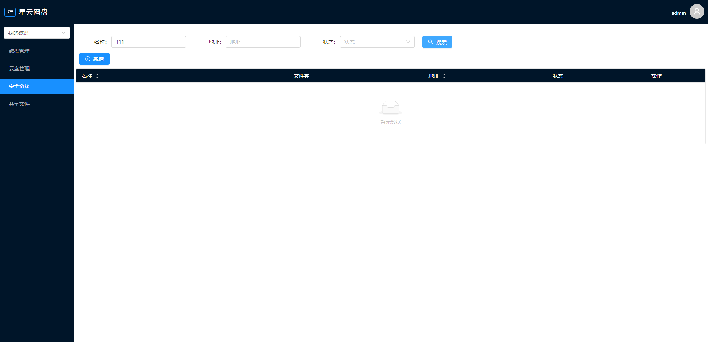
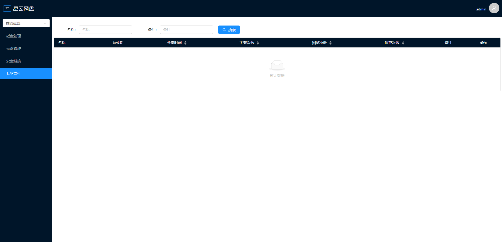

# 网盘_云盘-文件服务

### 介绍

文件服务，一个简单的云盘,拥有和百度云一样的文件存储，分享等功能。同时我们支持做文件服务器，支持分布式部署。

- 拥有开放接口可做支持对文件进行操作
- 拥有去冗余功能，一个文件服务器只有一份数据，更好的节省了服务器硬盘空间
- 支持文件分片上传，支持超大文件上传，支持多服务器存储文件
- 自动分析硬盘大小，合理分配存储空间
- 本系统采用了前后端分离开发，前端使用的是`angular`,后端采用`java`实现

### 功能介绍

* 账户信息：登录后可以查看个人。
* 网盘管理：（创建/编辑）文件名称或文件夹名称，上传文件，打包文件，生成cdn地址等。
* 共享管理：分享文件给好友，音乐播放器，图片查看器，视频播放器，复制，移动，编辑
* 安全链接：本网盘可以生成cdn连接，该功能是为了防止盗链设计的
* 支持直接接入做文件服务器，cdn服务器
* 支持分段上传，分段下载。

### 软件架构

* 基于基础服务实现单点登录
* 采用微服务架构搭建

### 使用技术

* `angular` 前端核心框架
* `NG-ZORRO` 阿里的前端ui
* `spark-md5` 前端md5加密工具，文件上传用到
* `spring-boot` 后端核心框架
* `spring-cloud-feign` 后端请求交互框架
* `mybatis-plus` 数据库操作框架
* `swagger2` 接口文档框架
* `thymeleaf` 模板引擎，登录注册等页面是单页面应用采用该框架实现
* `aliyun-java-sdk-core` 接入阿里云的发送短信
* `redis` 采用redis作为缓存数据库
* `mysql` 采用mysql作为数据储存数据库

### 使用注意

* 星云网盘交流群：553236240
* 本项目需要使用到基础服务平台，请加入交流群联系作者或管理员授权。
* 如在部署中遇到问题，请加入交流群联系作者或管理员解决。

### 演示地址

> * 现在很少玩扣扣了，紧急事情需要联系可以直接发邮件我会及时去查看QQ群消息

* QQ群：822523237
* 邮箱：925988564@qq.com
* 默认登录账号：admin
* 默认登录密码：123456

### 其他文档

* 开放接口文档`doc/开放接口文档.md`

### 安装教程

#### 基础服务平台导入操作数据

* 在基础服务应用管理创建应用
* 在应用操作中申请`doc/导入数据/需要申请的权限.md`中的全部权限，否则无法使用，可以批量申请权限，导入`doc/导入数据/需要申请的权限.json`就可以了
* 在基础服务平台导入

> * `doc/导入数据/基础数据/信息.json`
> * `doc/导入数据/基础数据/字典.json`
> * `doc/导入数据/基础数据/权限.json`
> * `doc/导入数据/基础数据/角色.json`
> * `doc/导入数据/基础数据/角色权限关联.json`
> * `doc/导入数据/接口数据/消息供应商.json` 需要修改账号秘钥
> * `doc/导入数据/接口数据/消息供应商.json` 发短信需要签名

#### 后端配置

* 创建mysql数据库`FCloud`运行`/doc/数据库/FCloud.sql`创建数据库结构
* 修改`/file-server/application-dev.yml`配置文件mysql链接地址

```yaml
spring:
  datasource:
    url: jdbc:mysql://localhost:3306/FCloud?useUnicode=true&characterEncoding=utf-8&useSSL=false&serverTimezone=GMT%2B8&allowPublicKeyRetrieval=true&autoReconnect=true
    username: root
    password: 123456
```

* 修改`/file-server/application-dev.yml`配置文件redis链接地址

```yaml
spring:
  redis:
    host: 127.0.0.1
    database: 2
    port: 6379
    password: 123456 
```

* 修改`/file-server/application-dev.yml`配置文件自定义配置

```yaml
#我的配置
xc:
  feign:
    basic: basic-server #基础服务名称，不必改
    basicUrl: https://xy.ccxc.vip:8802/BCloud #基础服务地址，对应BCloud的地址
  file:
    machineId: f001 #机器id,分布式使用
    folderPaths:
      - path: D:/home/file #储存文件地址,必须配置
        reserveSpace: 1073741824 #硬盘预留空间，单位直接，默认1GB
    #本机的地址
    localUrl: http://127.0.0.1:8812 #本机的新地址,项目迁移时使用
    localOldUrl: http://127.0.0.1:8812 #本机旧的地址,项目迁移时使用
    tempFolder:
      path: D:/home/file/tempFile #零时文件目录
      reserveSpace: 1073741824 #硬盘预留空间，单位直接，默认1GB
  aspect:
    openToken: true
    openAuthority: true #是否开启权限，true:开启，false:不开启
    appId: xc0019616597 #登录授权的应用id，基础服务申请获取
    appSecret: 45b991d8409518eb2438812760d12141e93de5f319e16500 #登录授权的应用秘钥，基础服务申请获取
```

#### 前端配置

> * 由于前端文件比较多，上传的是zip压缩包，在linux部署运行`deploy.sh`解压，windows需要手动解压
> * `public.zip`包
> * 下列配置只需要修改`filePath`,`basicPath`,`appId`

* 修改`file-server/public//assets/config.js`

```js
const CONFIG_PRO = {
	url: "",
	filePath: "http://127.0.0.1:8812",
	basicPath: "http://127.0.0.1:8811",
	pagePath: "",
	appId: "xc0019616597"
};
```

#### 其他配置

> 在linux运行的sh文件

* `restart.sh`：重启
* `start.sh`：启动
* `stop.sh`：停止
* `log.sh`：日志

> 在window运行的bat文件

* `restart.bat`：重启
* `start.bat`：启动
* `stop.bat`：停止

#### 使用说明

* 首页
  
* 磁盘管理
  
* 云盘管理
  
* 安全链接
  
* 共享文件
  


